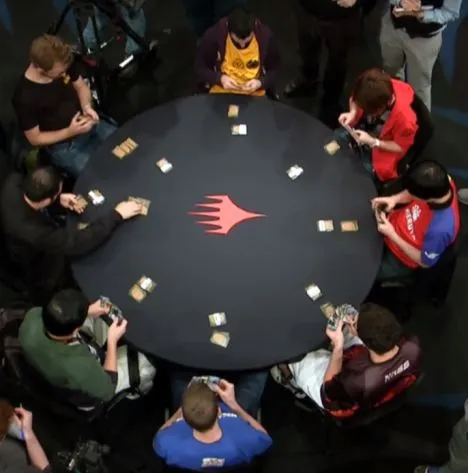
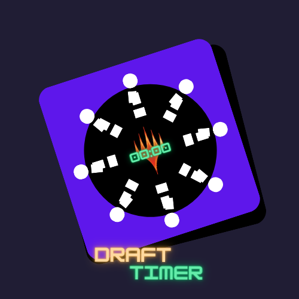
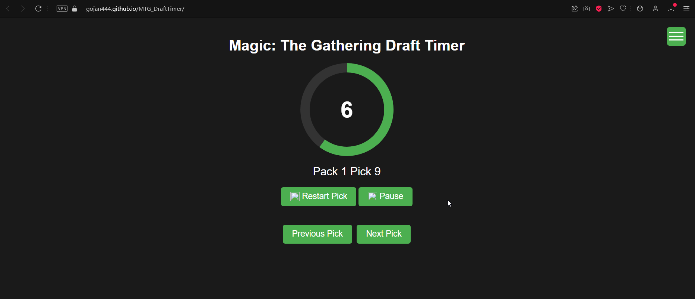

# MTG_DraftTimer V 0.0.1
 A Web Based Magic the Gathering Timer for Draft
 
If you're here, it's probably because you love to Play Draft, know the format and are looking for tools that will allow you and your friends to better play your Drafts. 
This Draft Timer was made in a few minutes using WebSim.ai but to improve its functions and open it more to the public I decided to replicate it here on Github, I hope you find it useful and share it. 

Github Site Link: https://gojan444.github.io/MTG_DraftTimer/

Websim.ai Link: https://websim.ai//@Gojan747/magic-the-gathering-draft-timer-1

 

Logo

### Preview 
  

 

La Meta

 
